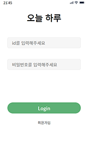
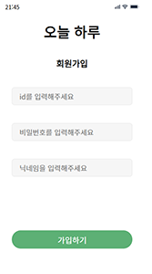
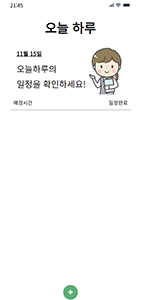

# 오늘 하루

오늘하루 할일을 정리할 수 있는 사이트

## 개요

node.js를 사용하여 서버를 만드는 실습을 위해 프로젝트를 시작하게 되었습니다.

백엔드는 node.js를 활용하였고 프론트는 Vue.js를 사용하여 구현하였습니다.

## 시작하기

- 레포지토리를 clone하여 프로젝트를 클론합니다
  ```js
    git clone https://github.com/wolun99/
  ```
- 서버는 backend 레포지토리를 사용하였고 뷰는 frontend 레포지토리를 사용합니다.
- 각 라이브러리 설치를 위해 각 레파지토리로 들어가서 install을 합니다.
  ```js
    npm install
  ```
- 프로젝트를 실행하기 위해 backend레포지토리로 들어가서 서버를 실행 시킵니다.
  ```js
    node index.js
  ```
- 프로젝트의 뷰를 실행하기 위해 frontend 레포지토리로 들어가서 실행시킵니다.
  ```js
    npm run serve
  ```

## 기술 스택

- Node
- Express
- MongoDB
- Vue
- Vuex

## 기능

1. 로그인

   

2. 회원가입

   

3. 할일 리스트

   

## 프로젝트를 진행하면 어려웠던 점

1. CORS에러가 발생했습니다.

   - 요청하는 port가 다르기 때문에 CORS에러가 발생했고 많은 방법중에 node.js의 라이브러리인 CORS 라이브러리를 사용하여 이 문제를 해결했습니다.

2. 암호화를 해야하는 부분이 발생했습니다.

   - 암호화 방식 중 비교가 가능한 bcrypt를 사용하여 비밀번호를 암호화하였습니다.

3. 로그인을 위해 사용자 정보를 저장해야 합니다.

   - 로그인을 사용하기 위해 세션과 쿠키 중 쿠키를 이용하였고 jwt토큰을 사용하여 사용자 정보를 저장했습니다.

4. 배포를 위해서 서버를 항상 실행할 필요가 있습니다.

   - 배포를 위해 서버에 파일들을 올린뒤 pm2라이브러리를 사용하여 무중단 서버실행을 하였습니다.

5. API를 통해 서버에 요청시 pending 상태로 계속 지속되었습니다.

   - 응답에 대한 상태코드를 정하지 않아 이러한 현상이 발생하기 때문에 응답에 대한 상태코드에 따른 전달할 데이터를 지정했습니다.

6. 로그인을 하지 않은 상태에서 URI을 통해 접속하면 로그인이 안되어 있기 때문에 에러가 발생합니다.
   - vue-router의 네비게이션 가드를 사용하여 로그인 상태를 확인하여 로그인이 되지 않았을 때 페이지의 이동이 발생하지 않도록 했습니다.
